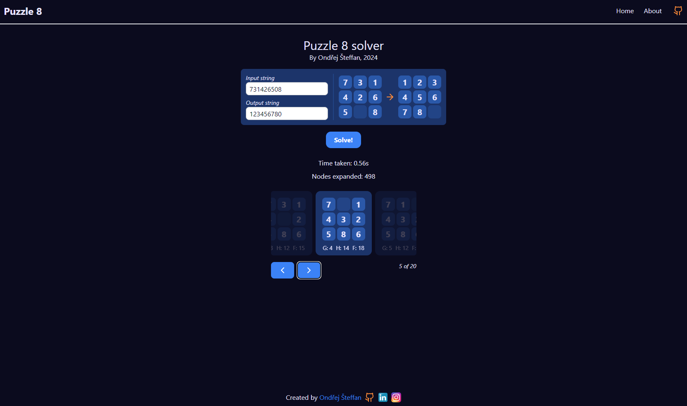

# Svelte Puzzle 8 (1Q2024)

> [!NOTE]  
> School project made in the last year of High School

## About

For this project I'm using [SvelteKit](https://kit.svelte.dev/) as frontend and [FastAPI](https://fastapi.tiangolo.com/) as backend. The goal is to create a solver for the puzzle 8 game. The solver uses A* algorithm to solve the puzzle.

### About puzzle 8
The game is simple, you have a 3x3 grid with 8 tiles and one empty space. You can move the tiles to the empty space and the goal is to get the tiles in order from 1 to 8 (Or any other configuration of your liking).

### About A* algorithm
A* is a graph traversal and path search algorithm, which is often used in many fields of computer science due to its completeness, optimality, and optimal efficiency.

I'm not going to talk about the complexity and how it works, there are many great articles about it, for example [this one](https://www.simplilearn.com/tutorials/artificial-intelligence-tutorial/a-star-algorithm#:~:text=EXPLORE%20PROGRAM-,Algorithm,will%20now%20discuss%20how%20to%20calculate%20the%20Heuristics%20for%20the%20nodes.,-Master%20Tools%20You), where there is more then enough information about it.



### Technologies used
The project is initiated from my [FastAPI + Svelte starter](https://github.com/OriginalStefikO/fastapi-svelte-starter) where you can learn more about the project structure.

## Requirements: 
- [Python 3.10+](https://www.python.org/downloads/)
- [NodeJS 16.0+](https://nodejs.org/en)

## Docker

```bash
docker build -t base:latest .
docker-compose up -d 
```

## How to run

1. Clone this repository

```git
git clone https://github.com/OriginalStefikO/svelte-puzzle-8.git .
```

2. If you want to run it locally, run setup script, otherwise build docker image and skip everything else

```cmd
npm run setup-project
# This will create virtual environment, install python dependencies and install all npm dependencies
```

```cmd
docker build -t svelte-puzzle-8 .
docker run -p 8080:8080 svelte-puzzle-8
```

4. If running locally, you can choose to run it in development mode, production mode or just build all and run

```cmd
npm run frontend-dev
# This will run frontend in development mode

npm run backend-dev
# This will run backend in development mode

npm run build-and-run
# This will build frontend, backend and run it
```

## If you like it you can give me a star ⭐, check out my profile and other projects
- [My GitHub profile](https://github.com/OriginalStefikO) - All my projects and more about me
- [FastAPI + Svelte starter](https://github.com/OriginalStefikO/fastapi-svelte-starter) - beginner friendly template and tutorial

> Or you can buy me a coffee, a lot of it was sacrificed for this project :D

<a href="https://www.buymeacoffee.com/stefiko" target="_blank"></a>

### License

<p xmlns:cc="http://creativecommons.org/ns#" xmlns:dct="http://purl.org/dc/terms/"><a property="dct:title" rel="cc:attributionURL" href="https://github.com/OriginalStefikO/svelte-puzzle-8">Svelte Puzzle 8 solver</a> by <a rel="cc:attributionURL dct:creator" property="cc:attributionName" href="https://github.com/OriginalStefikO">Ondřej Šteffan</a> is licensed under <a href="http://creativecommons.org/licenses/by/4.0/?ref=chooser-v1" target="_blank" rel="license noopener noreferrer" style="display:inline-block;">CC BY 4.0</a></p>
